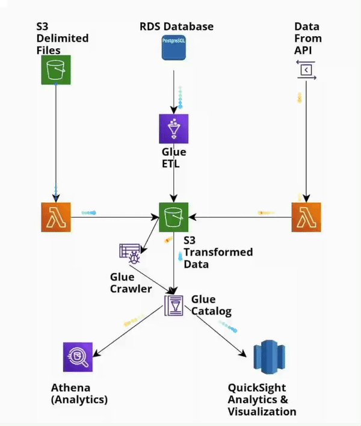

# 🚀 AWS Serverless Finance Data Pipeline


A scalable, serverless data pipeline built with **AWS CDK** to ingest, transform, and analyze financial data from multiple sources. This project demonstrates an end-to-end cloud data engineering workflow using **Lambda, Glue, Aurora, S3, Athena, and QuickSight**.

---

## 🏗️ Architecture



The pipeline integrates data from three distinct sources:
1.  **Historical Stock Data:** Stored in **Amazon Aurora** (PostgreSQL-compatible).
2.  **Historical FOREX Data:** Stored in **Amazon S3** (JSON format).
3.  **Intraday Stock Data:** Fetched in real-time via **Alpha Vantage API**.

### **Data Flow**
1.  **Ingestion:** AWS Lambda fetches intraday data from Alpha Vantage API and lands it in S3.
2.  **Storage:** Raw data accumulates in S3 Data Lake (Bronze Layer).
3.  **Transformation:** AWS Glue Crawlers and ETL Jobs process raw JSON/CSV data into Parquet/Catalog tables.
4.  **Analysis:** Amazon Athena provides SQL query access over S3 data.
5.  **Visualization:** Amazon QuickSight connects to Athena/Aurora for business intelligence dashboards.

---

## 🛠️ Tech Stack

*   **Infrastructure as Code:** AWS CDK (Python)
*   **Language:** Python 3.9+
*   **Compute:** AWS Lambda (Data Fetching), AWS Glue (ETL)
*   **Storage:** Amazon S3 (Data Lake), Amazon Aurora Serverless
*   **Query Engine:** Amazon Athena
*   **Visualization:** Amazon QuickSight

---

## 📂 Project Structure

```bash
aws-finance-pipeline/
├── app.py                   # CDK App Entry Point
├── cdk.json                 # CDK Context Configuration
├── stacks/
│   ├── lambda_stack.py      # Infrastructure for API Data Fetching
│   ├── glue_db_stack.py     # Glue Catalog & Database Definitions
│   └── glue_pipeline.py     # ETL Job Definitions
├── lambda/
│   └── fetch_data.py        # Python script for Alpha Vantage API
└── glue/
    └── etl_script.py        # Spark/Python ETL transformation logic
```

---

## 🚀 Getting Started

### Prerequisites
*   AWS CLI configured
*   Python 3.9+ installed
*   Node.js & AWS CDK installed (`npm install -g aws-cdk`)
*   Alpha Vantage API Key

### Deployment

1.  **Clone the repository:**
    ```bash
    git clone https://github.com/AnuAlli/aws-finance-pipeline.git
    cd aws-finance-pipeline
    ```

2.  **Install Python dependencies:**
    ```bash
    pip install -r requirements.txt
    ```

3.  **Bootstrap CDK (First time only):**
    ```bash
    cdk bootstrap
    ```

4.  **Deploy Stacks:**
    ```bash
    cdk deploy --all
    ```

---

## 💡 Key Learnings & Features
*   **Serverless First:** Zero infrastructure management using Lambda and Aurora Serverless.
*   **IaC Best Practices:** Entire infrastructure defined in Python code for reproducibility.
*   **Data Lake Patterns:** Implemented standard Bronze/Silver layers using S3 and Glue.
*   **Hybrid Data Source Integration:** Successfully joined relational data (Aurora) with object storage (S3).

---

## 📜 License
This project is open-source and available under the MIT License.
